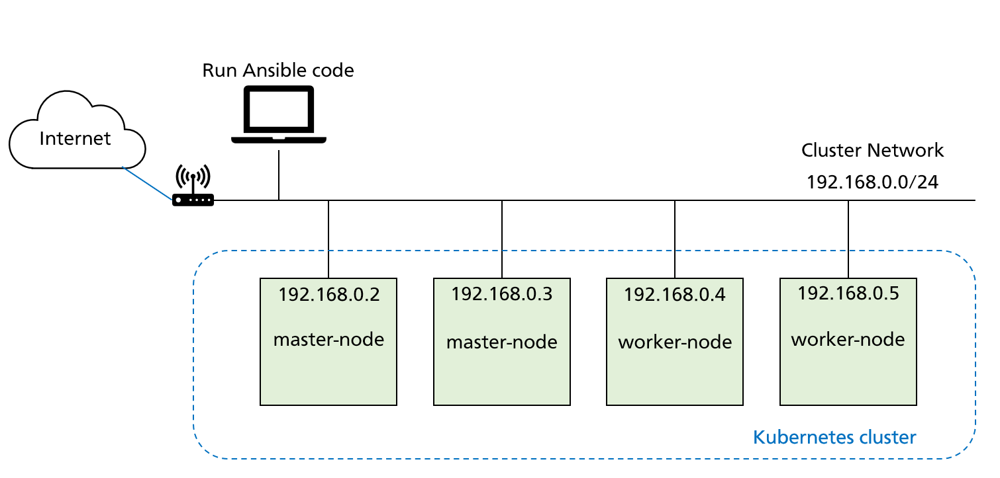

# Ansible + Kubeadm: Kubernetes Cluster Automation
このリポジトリでは、Ansibleを使用してkubeadmを用いたKubernetesクラスタの作成を自動で実行できるコードを提供しています。
## 構成例
以下の構成図の環境での実行を想定しています。ただし、`inventory.yaml`を編集することで、他の環境でも実行可能です。

## 前準備
Ansibleのコードを実行する前に、以下の作業を行う必要があります。
- 各VM（or 物理マシン）の作成
- Ubuntuのインストール
- SSH公開鍵認証の設定
- Ansibleの実行環境の準備
## 使用方法
1. inventory.yamlを編集し、ターゲット環境に合わせて構成を設定します。
2. Ansibleプレイブックを実行して、Kubernetesクラスタを自動的に構築します。
```
ansible-playbook -i inventory.yaml -bk deploy.yaml
```
