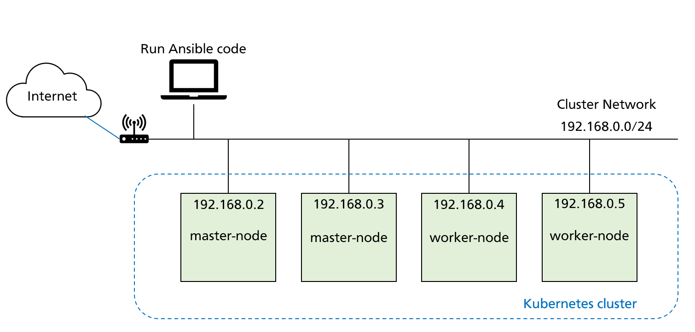

# Ansible + Kubeadm: Kubernetes Cluster Automation
このリポジトリでは、Ansibleを使用してkubeadmを用いたKubernetesクラスタの作成を自動で実行できるコードを提供しています。
## 構成例
以下の構成図の環境での実行を想定しています。ただし、`inventory.yaml`を編集することで、他の環境でも実行可能です。

## 仕様
- CNI (Container Network Interface): Flannel
- CSI (Container Storage Interface): cluster.local/nfs-subdir-external-provisioner
- CRI (Container Runtime Interface): cri-dockerd
## 前提条件
Ansibleのコードを実行する前に、以下の作業を行う必要があります。
- 各VM（or 物理マシン）の作成
- Ubuntuのインストール
- SSH公開鍵認証の設定
- Ansibleの実行環境の準備
## 使用方法
1. inventory.yamlを編集し、ターゲット環境に合わせて構成を設定します。
   - `ansible_host`のIPアドレスを環境に合わせる。
   - `ansible_ssh_private_key_file`を自分の秘密鍵のパスに変更する。 etc.

```
all:
  vars:
    control_plane_endpoint_ip: "192.168.0.2"
    cluster_network: "192.168.0.0/24"
  hosts:
    master-node:
      ansible_host: 192.168.0.2  # マスターノードのIPアドレス
      ansible_user: ubuntu         # SSH接続に使うユーザー名
      ansible_ssh_private_key_file: ~/.ssh/id_rsa
      ansible_ssh_common_args: '-o StrictHostKeyChecking=no -o UserKnownHostsFile=/dev/null'
    master-node-2:
      ansible_host: 192.168.0.3  # 追加のマスターノードのIPアドレス
      ansible_user: ubuntu         # SSH接続に使うユーザー名
      ansible_ssh_private_key_file: ~/.ssh/id_rsa
      ansible_ssh_common_args: '-o StrictHostKeyChecking=no -o UserKnownHostsFile=/dev/null'
    worker-node-1:
      ansible_host: 192.168.0.4  # ワーカーノード1のIPアドレス
      ansible_user: ubuntu
      ansible_ssh_private_key_file: ~/.ssh/id_rsa
      ansible_ssh_common_args: '-o StrictHostKeyChecking=no -o UserKnownHostsFile=/dev/null'
    worker-node-2:
      ansible_host: 192.168.0.5  # ワーカーノード2のIPアドレス
      ansible_user: ubuntu
      ansible_ssh_private_key_file: ~/.ssh/id_rsa
      ansible_ssh_common_args: '-o StrictHostKeyChecking=no -o UserKnownHostsFile=/dev/null'

  children:
    k8s-master:
      hosts:
        master-node:
    
    k8s-additional-masters:
      hosts:
        master-node-2:
    
    k8s-workers:
      hosts:
        worker-node-1:
        worker-node-2:
```


2. Ansibleプレイブックを実行して、Kubernetesクラスタを自動的に構築します。
```
ansible-playbook -i inventory.yaml -bk deploy.yaml
```
